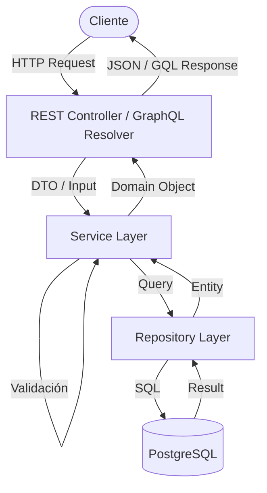

# Arquitectura del Sistema

El proyecto sigue una arquitectura de 3 capas claramente definidas para separar responsabilidades y facilitar el mantenimiento. Esto permite escalar tanto la lógica de negocio como las interfaces de usuario (REST y GraphQL) de manera independiente.

## Estructura de Capas y Flujo de Datos

El flujo típico de una solicitud es el siguiente:

**1. Interfaz (Interface Layer):**
    - **Endpoint (REST):** Recibe solicitudes HTTP, valida entradas con Pydantic y delega a un Servicio.
    - **Resolver (GraphQL):** Recibe queries/mutations, utiliza dataloaders para optimización y delega a un Servicio.
    - **Ubicación:** `app/api/v1/endpoints/` y `app/graphql/`.

**2. Capa de Servicios (Service Layer):**
    - Contiene la lógica de negocio **pura**. No conoce si la solicitud vino de REST o GraphQL.
    - Orquesta transacciones, realiza validaciones complejas de negocio y cálculos.
    - **Ubicación:** `app/services/`.
    - **Nota:** Los servicios son compartidos. Esto garantiza que la regla de negocio "No se puede facturar sin cliente activo" se aplique igual en ambos canales.

**3. Repositorio (Data Access Layer):**
    - Abstrae el acceso a la base de datos.
    - Utiliza SQLModel/SQLAlchemy para interactuar con PostgreSQL.
    - Implementa optimizaciones como `selectinload` para evitar el problema N+1.
    - **Ubicación:** `app/repositories/`.

**4. Modelos de Dominio:**
    - Definen las entidades y sus relaciones (User, Factura, Lote).
    - Son la fuente de la verdad para la estructura de datos.
    - **Ubicación:** `app/models/`.

## Flujo Detallado

## Guía para Desarrolladores

### Cómo añadir una nueva entidad

Para añadir una nueva entidad (ej: `Producto`), sigue estos pasos en orden:

1.  **Modelo (Domain):**
    Crea `app/models/producto.py`. Define la clase `Producto(SQLModel, table=True)`.
    Asegúrate de exportarla en `app/models/__init__.py`.

2.  **Repositorio (Data Access):**
    Crea `app/repositories/producto_repository.py`. Hereda de `BaseRepository` o implementa métodos CRUD específicos.

3.  **Servicio (Business Logic):**
    Crea `app/services/producto_service.py`. Aquí inyectarás el repositorio. Define métodos como `crear_producto` que contengan validaciones.

4.  **Interfaces (API):**
    - **REST:** Crea `app/schemas/producto.py` (Pydantic) y `app/api/v1/endpoints/productos.py` (Router). Registra el router en `app/api/v1/router.py`.
    - **GraphQL:** Crea `app/graphql/types.py` (Type) y añade queries/mutations en `app/graphql/schema.py`.

### Patrones Clave

- **Inyección de Dependencias:** Usamos `Depends` de FastAPI para inyectar la sesión de DB y los servicios en los controladores.
- **Manejo de Errores:** Lanzamos excepciones personalizadas (ej: `EntityNotFoundException`) desde la capa de servicio. Un middleware global en `app/api/errors` las captura y las convierte en respuestas HTTP 404/400 o errores GraphQL formateados.
